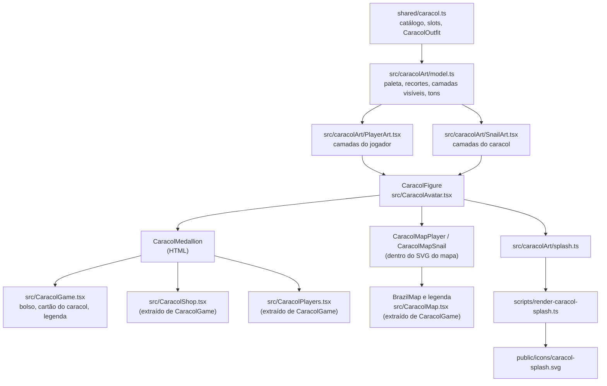

# Novo design do Caracol - Design

**Spec**: [spec.md](spec.md)
**Status**: Draft. A abordagem A abaixo é a recomendada e precisa do ok do dono antes de Execute.
**Polish** (2026-09-21): pendências conferidas em render nos tamanhos reais. Ver [Evidência do polish](#evidência-do-polish).

---

## Architecture Overview

Cada personagem é desenhado **uma vez**, em SVG, em coordenadas fixas.
Cada peça do catálogo é uma camada `<g data-layer="…">` desse desenho.
Cada "splash" (retrato, close do boné, pulso com relógio, corpo inteiro) é só um `viewBox` diferente sobre o mesmo desenho.



Nada muda em `server/`, `shared/` ou no banco: o outfit continua sendo `Record<slot, itemId | null>`.

### Abordagens consideradas

| | A. SVG inline em React, camadas em JSX (**recomendada**) | B. PNG/WebP por camada, empilhados | C. Sprite SVG externo com `<symbol>` e `<use href>` |
| --- | --- | --- | --- |
| Composição de 4⁵ outfits | Grátis: liga e desliga `<g>` | Grátis, mas cada camada é um arquivo alinhado no mesmo canvas | Um `<use>` por camada |
| Recorte por slot | `viewBox` | `object-position` + escala por recorte, frágil | `viewBox` no `<svg>` externo |
| Nitidez de 24 px à splash | Vetorial | Precisa de várias densidades | Vetorial |
| Custo de rede | Zero, vai no bundle (~25 kB de JSX) | 30 arquivos × densidades | 1 arquivo em cache |
| `clipPath` e filtro por instância | `useId` | N/A | Referência entre documentos: comportamento varia por navegador |
| Testável em node | Sim, com `renderToStaticMarkup` | Só por snapshot de imagem | Parcial |
| Quem desenha | Já desenhado no protótipo, porta 1:1 | Precisa de ilustrador | Porta 1:1 |

**Por que A**: o desenho já existe e foi validado no protótipo ([estudo/arte.mjs](estudo/arte.mjs)), a composição e os recortes saem de graça, e a feature fica testável sem adicionar jsdom.
B troca um problema resolvido por um pipeline de assets.
C economiza DOM, mas `clipPath` e filtro referenciados de outro arquivo são justamente a parte mais frágil entre navegadores.

---

## Code Reuse Analysis

### Existing Components to Leverage

| Component | Location | How to Use |
| --- | --- | --- |
| Catálogo e tipos de cosmético | `shared/caracol.ts:19-49` (`CARACOL_COSMETIC_SLOTS`, `CARACOL_COSMETIC_CATALOG`, `CaracolOutfit`, `CaracolCosmeticWearer`) | Importar. O teste de paridade (ARTE-05) lê o catálogo daqui. |
| Protótipo da arte | `plano/new-design/estudo/arte.mjs` | Fonte da geometria: portar cada string SVG para JSX sem mudar coordenadas. Os recortes vêm de `CROPS`. |
| Tokens de cor | `src/styles.css:3-26` | A paleta da arte copia os hex; ARTE-12 testa a paridade. |
| Componente extraído de `CaracolGame` | `src/CaracolRoulette.tsx` | Precedente para mover a loja e a lista para arquivos próprios. |
| `PlayerEffects` | `src/CaracolRoulette.tsx:102` | A lista extraída importa daqui, sem passar pelo socket. |
| Halo e cores de tom do mapa | `src/styles.css:971-974` | Os anéis dos tokens novos reaproveitam as cores `--acid`, `--coral` e o tracejado dos mortos. |
| `renderToStaticMarkup` | `react-dom/server` 19.2.8 | Testes de componente em node e geração da splash. |
| `tsx` | devDependency | Roda o script da splash (`tsx --tsconfig tsconfig.app.json`). |
| Estilo de teste | `tests/*.test.ts` com vitest | Mesmo diretório e padrão. Sem sockets: os testes novos não entram no flake registrado no handoff de `.specs/STATE.md`. |

### Integration Points

| System | Integration Method |
| --- | --- |
| Legenda do mapa | `src/CaracolGame.tsx:599`: o caracol vira `CaracolMedallion` de 24 px (T13). Depois a legenda vai para `src/CaracolMap.tsx` com o mapa, e "mortos" vira o halo tracejado (MAPA-05). |
| Bolso | `src/CaracolGame.tsx:602`: `CaracolMedallion` de 64 px. |
| Cartão do caracol | `src/CaracolGame.tsx:607`: `CaracolMedallion` de 72 px. |
| Lista de jogadores | `src/CaracolGame.tsx:615` → `src/CaracolPlayers.tsx`, medalhão de 40 px com tom. |
| Mapa | `src/CaracolGame.tsx:640-661` (`BrazilMap`) e `:734-741` (`project`, `featurePath`) → `src/CaracolMap.tsx`. Lá, `CaracolMapPlayer` e `CaracolMapSnail` entram no lugar de `mapPlayerAvatar`, `mapDeadAvatar` e `mapSnailAvatar`, que são apagados. |
| Loja | `src/CaracolGame.tsx:688-732` (`ShopDrawer`, `cosmeticSlotLabel`) → `src/CaracolShop.tsx`. |
| CSS | Sai `src/styles.css:911-969`, `:975-1009`, `:1016-1017`, `:1075-1077`, `:1088` e `:1170`. `:1067`, `:1071` e `:1073` deixam de mirar `circle` (ver Risks). Entra o bloco `.caracol-medallion`. |
| Vitest | `vitest.config.ts` ganha `esbuild: { jsx: 'automatic' }`. |
| Splash | `public/icons/caracol-splash.svg` passa a ser gerado. `index.html:14` não muda. |
| Scripts | `package.json` ganha `"splash:caracol": "tsx --tsconfig tsconfig.app.json scripts/render-caracol-splash.ts"`. |

---

## Components

### Modelo da arte

- **Purpose**: Tudo que é dado e regra, sem JSX: paleta, recortes, lista de camadas visíveis, tons e comparação de outfit.
- **Location**: `src/caracolArt/model.ts`
- **Interfaces**:
  - `CARACOL_ART_PALETTE` - objeto `as const` com os hex da [paleta](#paleta).
  - `CARACOL_ART_ITEM_IDS` - as 15 ids com arte, `as const`. É a fonte única: os mapas de camadas são tipados por ela.
  - `CARACOL_ART_CROPS: Record<CaracolCosmeticWearer, Record<CaracolArtCrop, CaracolArtBox>>` - a [tabela de recortes](#recortes).
  - `caracolArtViewBox(wearer, crop): string` - `"x y w h"`.
  - `caracolArtLayers(wearer, outfit): CaracolArtLayer[]` - camadas visíveis na [ordem de desenho](#ordem-das-camadas), já com defaults, franja e olhos resolvidos e ids sem arte descartados.
  - `caracolPlayerTone({ isYou, isTarget, alive }): CaracolMedallionTone` - prioridade `dead` > `target` > `you` > `default`.
  - `caracolShopItemTone({ owned, equipped, coins, price }): CaracolMedallionTone` - `equipped`, `unaffordable` ou `default`.
  - `sameCaracolOutfit(a, b): boolean` - compara os cinco slots por valor.
  - `CARACOL_INK_MIN_PX = 56`.
- **Dependencies**: `shared/caracol.ts`.
- **Reuses**: `CROPS` e a ordem de `layerPlan` do protótipo.

### Arte do jogador e do caracol

- **Purpose**: O desenho, camada por camada, em JSX.
- **Location**: `src/caracolArt/PlayerArt.tsx`, `src/caracolArt/SnailArt.tsx`
- **Interfaces**:
  - `PLAYER_ART: Record<PlayerArtLayer, (ids: CaracolArtIds) => JSX.Element>`
  - `SNAIL_ART: Record<SnailArtLayer, (ids: CaracolArtIds) => JSX.Element>`
  - `CaracolArtIds = { clip: (part: string) => string; ink: string }` - ids únicos da instância, para `clipPath` e filtro.
- **Dependencies**: `model.ts` (paleta e tipos das camadas).
- **Reuses**: Geometria e cores de `estudo/arte.mjs`, portadas sem mudança. O protótipo já usa a pele `#c78261` (ARTE-15).
- **Regras de porte**: cada camada é um `<g data-layer="<chave>">`. As listras da camisa listrada usam `clipPath` com o id da instância, uma por parte (manga esquerda, manga direita, tronco), nessa ordem: pinta, estampa, contorna. É isso que esconde a costura interna da manga.

### CaracolFigure

- **Purpose**: O `<svg>` de um personagem num recorte. É o único lugar que desenha.
- **Location**: `src/CaracolAvatar.tsx`
- **Interfaces**:
  - `CaracolFigure({ wearer, outfit, crop, sizePx, x?, y?, width?, height? }): JSX.Element` - `viewBox` do recorte, camadas de `caracolArtLayers`, `aria-hidden="true"`, filtro de tinta só quando `sizePx >= CARACOL_INK_MIN_PX`.
  - `sameFigureProps(prev, next): boolean` - comparador do `React.memo`: igual quando `wearer`, `crop`, `sizePx`, posição e `sameCaracolOutfit` batem.
- **Dependencies**: `model.ts`, `PlayerArt.tsx`, `SnailArt.tsx`, `useId` do React.
- **Reuses**: O filtro do protótipo (`feTurbulence` com `baseFrequency 0.035`, `numOctaves 2`, `seed 3`, e `feDisplacementMap` com `scale 1.7`).

### CaracolMedallion

- **Purpose**: O retrato circular usado em HTML: bolso, cartão, lista, abas, legenda e cards da loja.
- **Location**: `src/CaracolAvatar.tsx`
- **Interfaces**:
  - `CaracolMedallion({ wearer, outfit, crop = 'portrait', size, tone = 'default', label }): JSX.Element`
- **Markup**:
  ```html
  <span class="caracol-avatar" role="img" aria-label="…" style="--medallion-size: 40px">
    <span class="caracol-medallion tone-default"><svg aria-hidden="true">…</svg></span>
    <span class="caracol-avatar-badge badge-check | badge-skull"></span>  <!-- só equipped e dead -->
  </span>
  ```
  O selo fica fora de `.caracol-medallion` porque o círculo tem `overflow: hidden`.
- **Tons**: o anel nunca é o único portador do estado. Cada tom tem um texto na mesma tela que diz a mesma coisa, porque acid-dark e coral sobre o papel ficam abaixo de 3:1.

  | Tom | Visual | Texto que acompanha |
  | --- | --- | --- |
  | `default` | anel night de 1,5 px | - |
  | `you` | anel acid-dark de 2,5 px | "você" na linha |
  | `target` | anel coral de 2,5 px | selo "alvo" |
  | `dead` | cinza (`grayscale(1)`, `opacity: .55`) e selo de caveira | "morta" e `aria-label` "<nick> morta" |
  | `equipped` | anel ácido de 3 px com contorno night de 2 px, selo de check | "Equipado" |
  | `unaffordable` | peça **em cor**; anel sólido trocado por `outline: 2px dashed` `--muted-dark` | "Faltam N moedas" e botão desabilitado |

  O cinza é reservado a `dead`: fora do jogo, como o "encontrado" do Waldo. Uma peça sem saldo continua em cor porque a cor é o que o card vende.
  O tamanho entra por `--medallion-size`, e nunca como `width` inline, para a media query de 620 px conseguir sobrescrever.
- **Dependencies**: `CaracolFigure`.

### Tokens do mapa

- **Purpose**: Os mesmos desenhos dentro do `<svg>` do mapa (760 × 570 unidades).
- **Location**: `src/CaracolAvatar.tsx`
- **Interfaces**:
  - `CaracolMapPlayer({ outfit, x, y, radius, tone }): JSX.Element` - `<g transform="translate(x y)">` com círculo de papel, `<g clip-path>` circular envolvendo `CaracolFigure` (`x=-r`, `y=-r`, `width=height=2r`, recorte `portrait`) e anel de 2,5 unidades na cor do tom. Com tom `dead`, o `<g>` recebe um filtro `feColorMatrix type="saturate" values="0"` com id da instância, e o anel é tracejado.
  - **Ordem de desenho** (MAPA-06): `BrazilMap` ordena os tokens por camada, mortos, demais, alvo, você, antes de renderizar. No render do polish, sem isso, o token de São Paulo sumia sob Guarulhos e Campinas.
  - `CaracolMapSnail({ outfit, x, y }): JSX.Element` - `CaracolFigure` recorte `full`, 40 × 40 unidades, posicionada em `(x − 20, y − 38)`, para o pé cair sobre o ponto.
- **Dependencies**: `CaracolFigure`, `model.ts`.
- **Por que `feColorMatrix` e não `filter: grayscale()` do CSS**: dentro do SVG do mapa o filtro SVG funciona igual em todo navegador. No HTML, o medalhão usa o CSS, que já é bem suportado.

### Loja extraída

- **Purpose**: A gaveta da loja, fora do arquivo que abre o socket, para poder ser testada.
- **Location**: `src/CaracolShop.tsx`
- **Interfaces**:
  - `CaracolShopDrawer(props)` - mesmas props de hoje (`state`, `open`, `tab`, `onTabChange`, `onClose`, `onPurchase`, `onEquip`).
  - `shopPreviewReducer(state, action): ShopPreviewState` - `{ trying: string | null }`, com as ações `try`, `leave`, `toggle` (prova a peça ou desfaz, se já é ela, LOJA-12) e `tab` (zera a prova, LOJA-10).
  - `shopCardHandlers(dispatch, itemId)` - devolve `onMouseEnter`, `onMouseLeave`, `onFocus` e `onBlur` do card e `onClick` do botão do medalhão, que só chamam `dispatch` (LOJA-11).
  - O medalhão do card fica dentro de `<button type="button" aria-pressed aria-label="Provar <nome>">`. É o caminho do provador no toque, onde não há hover (LOJA-12).
  - `shopPreview(outfit, tryingItem): { outfit, label: 'Provando' | 'Visual atual' }`.
- **Dependencies**: `CaracolMedallion`, `CaracolFigure`, `model.ts`, `shared/caracol.ts`.
- **Reuses**: `ShopDrawer` e `cosmeticSlotLabel` de `src/CaracolGame.tsx:688-732`, movidos sem mudar comportamento antes de qualquer mudança visual.

### Lista extraída

- **Purpose**: O cartão "No mapa", fora de `CaracolGame.tsx`.
- **Location**: `src/CaracolPlayers.tsx`
- **Interfaces**:
  - `CaracolPlayersCard({ players, targetAccountId }): JSX.Element` - o markup de `src/CaracolGame.tsx:615`, movido; depois, com `CaracolMedallion` e `caracolPlayerTone`.
- **Dependencies**: `CaracolMedallion`, `PlayerEffects` (`src/CaracolRoulette.tsx:102`).

### Mapa extraído

- **Purpose**: O mapa do Brasil e a legenda, fora de `CaracolGame.tsx`, para os tokens e o Blooper serem testáveis.
- **Location**: `src/CaracolMap.tsx`
- **Interfaces**:
  - `BrazilMap({ state, geoJson }): JSX.Element` - movido de `src/CaracolGame.tsx:640`, com `project` e `featurePath` (`:734-741`) e os tipos `GeoFeature`/`GeoFeatureCollection` de que dependem.
  - `CaracolMapLegend({ snailOutfit }): JSX.Element` - o markup de `src/CaracolGame.tsx:599`.
- **Dependencies**: `CaracolMapPlayer`, `CaracolMapSnail`, `CaracolMedallion`, `caracolPlayerTone`.

### Splash

- **Purpose**: Gerar o SVG estático da splash a partir do mesmo desenho.
- **Location**: `src/caracolArt/splash.ts` (função pura) e `scripts/render-caracol-splash.ts` (grava o arquivo).
- **Interfaces**:
  - `renderCaracolSplash(): string` - `<svg viewBox="0 0 1170 2532">` com fundo `#151525`, medalhão de 560 unidades centrado em `(585, 1186)`, onde está o ícone hoje, com o caracol sem peças (`renderToStaticMarkup` de `CaracolFigure`), e o texto `CARACOL` com a fonte da splash atual (58 px, `Arial, sans-serif`, bold, `#f6f2e8`) em `y = 1610`. Na posição atual (`y = 1540`) o texto encostava no medalhão, como mostrou o render do polish.
- **Dependencies**: `CaracolFigure`, `react-dom/server`.
- **Determinismo**: `renderToStaticMarkup` numera `useId` a partir de zero em cada chamada, então a saída é estável e o teste de deriva (SPL-03) pode comparar texto.

---

## Data Models

Sem mudança de dados persistidos nem de protocolo. Tipos novos, só no cliente:

```typescript
type CaracolArtCrop = 'portrait' | 'full' | CaracolCosmeticSlot;
type CaracolArtBox = readonly [x: number, y: number, width: number, height: number];
type CaracolArtItemId = typeof CARACOL_ART_ITEM_IDS[number];
type CaracolMedallionTone = 'default' | 'you' | 'target' | 'dead' | 'equipped' | 'unaffordable';

type PlayerArtLayer =
  | 'legs' | 'pants-default' | 'arms' | 'shirt-default' | 'head' | 'fringe' | 'eyes' | 'mouth'
  | CaracolArtItemId;
type SnailArtLayer = 'body' | 'stalks' | 'head' | CaracolArtItemId;
```

### Recortes

Valores do protótipo, conferidos no estudo. Coordenadas do desenho: jogador em 200 × 400, caracol em 240 × 240.

| Recorte | Jogador `[x, y, w, h]` | Caracol `[x, y, w, h]` | Mostra |
| --- | --- | --- | --- |
| `full` | `[18, 14, 172, 372]` | `[6, -6, 236, 236]` | Corpo inteiro |
| `portrait` | `[30, 24, 140, 140]` | `[22, -6, 150, 150]` | Busto, com a mão erguida / as antenas |
| `cap` | `[48, 14, 104, 104]` | `[48, 36, 94, 94]` | Cabeça |
| `glasses` | `[56, 42, 88, 88]` | `[42, -26, 106, 106]` | Olhos |
| `shirt` | `[30, 110, 140, 140]` | `[34, 104, 122, 122]` | Tronco |
| `watch` | `[127, 74, 60, 60]` | `[48, 26, 58, 58]` | Pulso / antena esquerda |
| `pants` | `[20, 222, 160, 160]` | `[38, 140, 114, 114]` | Pernas / pé |

### Ordem das camadas

De trás para frente. Entre colchetes, o que é peça do catálogo; só uma por slot aparece.

- **Jogador**: `legs` → [`pants-default` \| calças] → `arms` (braços, mão e pescoço) → [`shirt-default` \| camisas] → [relógios] → `head` (cabelo de trás, orelhas, rosto) → `fringe` (some com boné) → `eyes` (somem com óculos) → `mouth` → [óculos] → [bonés]
- **Caracol**: `body` (sombra, concha, pé, pescoço) → [calças] → [camisas] → `stalks` → [relógios] → `head` (olhos, cabeça, boca) → [bonés] → [óculos]

### Paleta

| Nome | Hex | Origem |
| --- | --- | --- |
| `ink` | `#151525` | `--night` |
| `paper` | `#f6f2e8` | `--paper` |
| `white` | `#fffdf8` | fundo do medalhão |
| `acid` / `acidDark` | `#ddf45c` / `#94a329` | `--acid` / `--acid-dark` |
| `coral` | `#ff745f` | `--coral` |
| `sky` | `#75d9e9` | `--sky` |
| `lavender` | `#b39bff` | `--lavender` |
| `skin` | `#c78261` | avatar atual (`src/styles.css:933`) |
| `hair` | `#4a2d25` | estudo |
| `shell` / `snailBody` | `#d86b51` / `#efb37d` | avatar atual (`src/styles.css:937-938`) |
| `jeans`, `jeansLight`, `olive`, `oliveDark`, `tropical`, `basic`, `gold`, `goldDark` | `#4d628f`, `#7189bd`, `#7b7753`, `#5f5c3f`, `#4f9f7f`, `#e8d6c2`, `#e7bc52`, `#9c722b` | cores das peças no CSS atual (`src/styles.css:952-969`) e no estudo |

### Tamanhos por superfície

| Superfície | Hoje | Novo |
| --- | --- | --- |
| Legenda do mapa | `tiny` 31 × 29 | medalhão 24 px |
| Abas da loja | `tiny` 31 × 29 | medalhão 32 px |
| Lista de jogadores | 39 × 37 | medalhão 40 px |
| Bolso | `small` 62 × 58 | medalhão 64 px |
| Cartão do caracol | `medium` 74 × 69 | medalhão 72 px com tinta |
| Prévia da loja | `large` 112 × 103 | corpo inteiro 176 px de altura + medalhão 112 px, ambos com tinta; em ≤ 620 px, 120 px + 72 px, para sobrar altura à lista que rola embaixo |
| Card da loja | `small` 62 × 58 numa área de 102 px | medalhão 88 px com tinta; 68 px em ≤ 620 px, sem tinta |
| Token do jogador no mapa | figura de 16 unidades | círculo de raio 9 (você, alvo) ou 7 |
| Token do caracol no mapa | 36 × 26 unidades | corpo inteiro 40 × 40 unidades |

---

## Error Handling Strategy

| Error Scenario | Handling | User Impact |
| --- | --- | --- |
| Outfit com id que a arte não conhece (peça nova no catálogo sem arte) | `caracolArtLayers` descarta a id e aplica o default do slot (ARTE-06) | Vê o personagem sem aquela peça. O CI já teria falhado por ARTE-05. |
| Todos os slots `null` | Jogador com camisa e calça padrão, caracol sem peças | Visual inicial, como hoje. |
| Blooper (`lat`/`lon` `null`) | `BrazilMap` não renderiza `CaracolMapSnail` nem a rota (MAPA-04) | Caracol some do mapa, como hoje. |
| GeoJSON ainda carregando | Sem mudança: "Desenhando o Brasil…" | Igual a hoje. |

---

## Risks & Concerns

| Concern | Location (file:line) | Impact | Mitigation |
| --- | --- | --- | --- |
| Regras CSS de descendente repintam o desenho: `.map-player circle`, `.map-player-you circle`, `.map-player-target circle` e `.snail-token circle` valem para **todo** `<circle>` dentro do token, e CSS vence atributo de apresentação SVG | `src/styles.css:1067`, `:1071`, `:1073`, `:1075` | Olhos, mãos, lentes e mostradores do relógio ficariam céu, ácido ou coral no mapa | T21 troca essas regras por classes do anel (`.map-medallion-ring.tone-*`) e o teste-guarda de T21 falha se `circle {` voltar a aparecer depois de `.map-player` ou `.snail-token` |
| `.caracol-player-row div span` (fonte mono, `overflow: hidden`) e `.caracol-player-row > div` (grid, `flex: 1`) pegam qualquer `span`/`div` dentro da linha | `src/styles.css:1156`, `:1162` | Um medalhão dentro de um `div` da linha herdaria fonte e seria esticado | O medalhão é feito só de `span` e fica filho direto da linha, fora do `div` de texto (T16) |
| Token do jogador ilegível no celular: o mapa escala por `viewBox`, e a 0,47 px por unidade o raio 7 vira 6,6 px | `src/CaracolGame.tsx:641` (760 × 570 unidades) | O retrato não lê no celular | Aceito: a cor do anel carrega o estado, como o boneco de hoje. Raio 12/9 foi testado e só amontoa o Sudeste. Nome aparece para você, alvo e mortos, como hoje |
| Re-render a cada tick: o servidor transmite o estado inteiro a cada 1 s, e cada payload cria objetos de outfit novos | `server/caracol/game.ts:112`, `:1184`, `:1301`, `:1316`, `:1338`, `:1342` | Com SVG de 40 a 120 nós por avatar, 50 jogadores no mapa e na lista re-renderizariam uns 10 mil nós por segundo | `React.memo` com `sameFigureProps` (ARTE-13), e tinta desligada abaixo de 56 px (ARTE-09) |
| Vitest não renderiza TSX: sem `jsx` no `tsconfig.json` da raiz nem plugin React no `vitest.config.ts` | `vitest.config.ts:3`, `tsconfig.json:1` | Qualquer teste de componente falha com "React is not defined" (verificado) | T1 adiciona `esbuild: { jsx: 'automatic' }` (verificado: renderiza) |
| Sem jsdom nem Testing Library: eventos de hover e foco não são exercitáveis | `package.json` (devDependencies) | O provador não teria teste de comportamento | Estado do provador em `shopPreviewReducer` e handlers em `shopCardHandlers`, puros e testados. A ligação no JSX fica para o UAT. |
| Importar `CaracolGame.tsx` executa `io()` no carregamento do módulo. **Não verifiquei** o comportamento em node sem `location`. | `src/socket.ts:70`, `src/caracolSocket.ts:6` | Loja, lista e mapa ficariam sem teste | Mover `ShopDrawer`, a lista e o mapa para arquivos próprios, só movendo, antes de mudá-los (T10, T15, T19), como já foi feito com `CaracolRoulette.tsx`. Nenhum teste importa `CaracolGame.tsx`; o que sobra nele é conferido por teste-guarda que lê o fonte. |
| Lista de jogadores em uma linha de ~800 caracteres, com ternários aninhados | `src/CaracolGame.tsx:615` | Editar no lugar é fácil de errar | A extração (T15) quebra o markup em linhas, só movendo, antes de qualquer troca de avatar |
| Ids de `clipPath` e filtro duplicados entre instâncias | `estudo/arte.mjs` (ids por `uid`) | `url(#…)` resolveria para a instância errada | `useId` por instância. React 19.2.8 gera `_R_0_`, válido dentro de `url()` (verificado); ARTE-10 testa |
| Cor duplicada entre CSS e arte | `src/styles.css:9-26` | Mudar um token e esquecer a arte | Teste de paridade ARTE-12 lê `:root` |
| Splash em SVG como `apple-touch-startup-image`: **não verifiquei** se o iOS exibe SVG nessa tag. A documentação que conheço fala de PNG por tamanho de tela. | `index.html:14` | A splash nova pode nem aparecer no iPhone, como talvez já não apareça hoje | Herdado do código atual e fora do escopo. UAT num iPhone com o PWA instalado; se não aparecer, a correção (rasterizar) vira feature própria |
| Listrada + Redondos + Aba reta lembra o Waldo | `estudo/arte.mjs` (`shirt-striped`, `glasses-round`) | Parecença com personagem protegido | Listras coral, não vermelhas; sem gorro de pompom; paleta do jogo; o visual padrão não usa nenhuma dessas peças |
| Suíte de integração com flake de timeout de socket | `.specs/STATE.md` (Handoff) | Falso vermelho no gate completo | Testes novos rodam em node, sem socket. O gate rápido roda só eles; no gate completo, uma falha `Timeout esperando <evento>` em teste antigo é reexecutada uma vez e registrada, nunca ignorada |
| Glifos `☠` como ícone | `src/CaracolGame.tsx:599`, `:615`; `src/styles.css:1088`, `:1170` | O desenho do caractere muda por sistema, e o estudo da roleta já decidiu "nenhum emoji" | Selo de caveira em SVG (LISTA-03) e halo tracejado na legenda (MAPA-05) |

---

## Tech Decisions

| Decision | Choice | Rationale |
| --- | --- | --- |
| Um desenho, vários recortes | `viewBox` por recorte sobre coordenadas fixas | Uma peça nova é uma camada e herda todos os recortes |
| Atributo de teste e depuração | `data-layer` em cada `<g>` de camada | Os testes checam camadas sem depender da geometria |
| Ids por instância | `useId` | Sem contador global, estável no `renderToStaticMarkup` |
| Tinta tremida | Filtro SVG só a partir de 56 px | Invisível abaixo disso e caro no mapa |
| Cinza | Só para `dead`: CSS `filter: grayscale(1)` + `opacity: .55` no HTML; `feColorMatrix` no mapa | Cinza significa "fora do jogo"; suporte uniforme em cada contexto |
| Sem saldo | Peça em cor com `outline: 2px dashed` `--muted-dark` | O `outline` segue o `border-radius` nos navegadores atuais, e a peça continua legível |
| Tamanho do medalhão | Variável CSS `--medallion-size` | A media query sobrescreve sem `!important` |
| Paleta em TS | Hex no módulo de arte | `var()` não funciona em atributo de apresentação SVG nem na splash estática |
| Testes de componente | `renderToStaticMarkup` em node | Sem dependência nova. Verificado com React 19.2.8 |

> **AD proposto** para `.specs/STATE.md` quando este design for aprovado: *"A arte de personagem do Caracol é SVG em React, uma camada por peça do catálogo, recortada por `viewBox`. Peça nova no catálogo exige arte para os dois personagens, garantido pelo teste de paridade."* Escopo: `src/caracolArt/`, `shared/caracol.ts` (catálogo).

---

## Evidência do polish

Uma rodada de render com as decisões aplicadas, nos tamanhos em que a arte vai viver: [estudo/polish-desktop.png](estudo/polish-desktop.png) (1280 px) e [estudo/polish-mobile.png](estudo/polish-mobile.png) (390 px).
Para regerar: `node plano/new-design/estudo/evidencia.mjs` e abra os dois HTML gerados ao lado do script.

| Pendência | O que o render mostrou | Decisão |
| --- | --- | --- |
| Pele | `#c78261` e `#f0bf9b` leem bem; o cabelo separa da pele nos dois | `#c78261` para todos (dono) |
| Tinta | Até 48 px o tremido só borra; de 56 px em diante dá o caráter | Limiar de 56 px mantido |
| Sem saldo | O cinza apagava a peça e ficava igual a "morta" | Em cor, com anel tracejado (dono) |
| Provador | Só existia com mouse | Medalhão do card vira botão (LOJA-12) |
| Mapa, desktop | Raio 9/7 lê; o caracol de 40 unidades se reconhece | Mantido |
| Mapa, celular | Todo token vira ponto de 6 a 8 px; raio 12/9 amontoa o Sudeste | Mantido 9/7; a cor do anel carrega o estado |
| Mapa, sobreposição | "Você" em São Paulo ficava coberto | Ordem de desenho (MAPA-06) |
| Splash | `CARACOL` encostava no medalhão | Texto em `y = 1610` |
| Prévia no celular | Prévia de 176 px deixaria pouca altura para a lista | 120 px + 72 px em ≤ 620 px |

O canvas do estudo ainda mostra o cinza em "sem saldo". Vale este documento.

